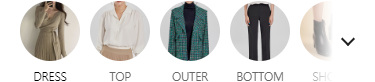
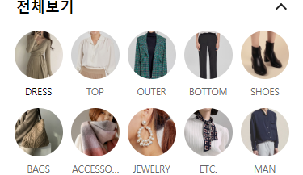
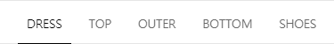

# 가로 스크롤 메뉴 & 인피니티 스크롤

> 가로 스크롤 카테고리 메뉴 및 해당 카테고리 상품에 대한 인피니티 스크리롤 구현.

## 개발 환경
- 프론트엔드 구현 방법은 React(CRA)로 개발합니다.
- 이미지는 더미 이미지로 대체 합니다. (https://placeholder.com/)

#### 가로 스크롤 메뉴
- 접기, 펼치기 기능을 통해 모든 메뉴를 한번에 볼 수 있습니다.
- 클릭 시 현재 메뉴를 활성화 하고 가운데로 이동 되어야 합니다.
- 아래로 스크롤 시 메뉴가 사라지지 않고 상단에 고정 되어야 합니다.

**가로 스크롤**

**펼쳐 보기**

**아래로 스크롤 시**

#### 인피니티 스크롤
- 현재 활성화된 카테고리 기준으로 인피니티 스크롤을 통해 상품을 20개씩 추가합니다.
- 카테고리 메뉴 클릭 시 카테고리 ID, endOPage 정보를 바탕으로 비동기 처리 후 인피니티 스크롤이 초기화 되어야 합니다.
- 활성화된 메뉴 클릭 시 중복해서 비동기 처리가 발생되지 않아야 합니다.
- 데이터가 없으면 "해당 카테고리에 상품이 없습니다." 화면이 표시 되어야 합니다.
- 좌, 우 유닛 높이는 큰 값을 기준으로 동일해야 합니다.
- 뒤로가기(히스토리백) 시 이전 데이터 상태가 유지되어야 합니다.

#### 데모 영상

<video width="100%" height="100%" muted playsinline controls>
  <source type="video/mp4" src="./img/demo.mp4"></source>
</video>

### 제출방법
- Github에 레포지터리 생성 후 프로젝트 업로드 경로 제출
- 빌드 후 정적 사이트 배포. 결과물 확인 경로 제출 (GitHub Pages, Netlify..)
